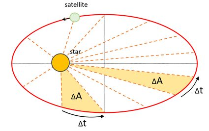

Below is a detailed Markdown document addressing "Problem 1: Orbital Period and Orbital Radius." It includes a derivation of Kepler's Third Law for circular orbits, a discussion of its implications, real-world examples, a Python script for simulation and visualization, and an extension to elliptical orbits.

---

# Orbital Period and Orbital Radius

## Introduction
Kepler’s Third Law establishes a fundamental relationship in celestial mechanics: the square of an object’s orbital period ($T^2$) is proportional to the cube of its orbital radius ($r^3$). Originally formulated for planetary orbits around the Sun, this law applies to any two-body system under gravitational influence, such as satellites orbiting Earth or the Moon orbiting our planet. This document derives the law for circular orbits, explores its astronomical implications, analyzes real-world examples, and provides a computational model to verify and visualize the relationship.

---

## Derivation of Kepler’s Third Law for Circular Orbits

### Physical Basis
For a body in a circular orbit, the gravitational force provides the necessary centripetal force to maintain circular motion. Let’s derive the relationship step-by-step:

1. **Gravitational Force**:
   The gravitational force between two masses ($M$ for the central body, $m$ for the orbiting body) is:

   $F_g = \frac{G M m}{r^2}$

   Where:

   - $G$: Gravitational constant ($6.67430 \times 10^{-11} \, \text{m}^3 \text{kg}^{-1} \text{s}^{-2}$)

   - $r$: Orbital radius (distance from the center of $M$)

2. **Centripetal Force**:

   For circular motion, the centripetal force is:

   $F_c = \frac{m v^2}{r}$

   Where $v$ is the orbital velocity.

3. **3Equating Forces**:
   Since $F_g = F_c$:
   
   $\frac{G M m}{r^2} = \frac{m v^2}{r}$

   Cancel $m$ (assuming $m \neq 0$) and simplify:

   $\frac{G M}{r^2} = \frac{v^2}{r}$
   
   Multiply both sides by $r$:

   $v^2 = \frac{G M}{r}$

4. **Orbital Velocity and Period**:

   The orbital velocity is the circumference divided by the period ($T$):
  
   $v = \frac{2 \pi r}{T}$
  
   Square this:
   
   $v^2 = \frac{4 \pi^2 r^2}{T^2}$

5. **Substitute and Solve**:
   Substitute $v^2$ into the force equation:
   $\frac{4 \pi^2 r^2}{T^2} = \frac{G M}{r}$

   Multiply both sides by $T^2$ and divide by $\frac{G M}{r}$:

   $4 \pi^2 r^2 = \frac{G M}{r} T^2$
   
   Multiply both sides by $r$:

   $4 \pi^2 r^3 = G M T^2$
   
   Rearrange:

   $T^2 = \frac{4 \pi^2}{G M} r^3$

   This shows $T^2 \propto r^3$, with the constant of proportionality $\frac{4 \pi^2}{G M}$.

### Final Form

For circular orbits:

$T^2 = \left( \frac{4 \pi^2}{G M} \right) r^3$

This is Kepler’s Third Law for circular orbits, where the constant depends only on the central mass $M$.

[Kepler's Third Law Simulation](Kepler's_Third_Law_Simulation.html)

---

## Implications for Astronomy

1. **Determining Planetary Masses**:
   - If $T$ and $r$ are measured (e.g., via observation of a moon or satellite), $M$ can be calculated:

     $M = \frac{4 \pi^2 r^3}{G T^2}$

   - Example: The Moon’s orbit around Earth allows us to estimate Earth’s mass.

2. **Measuring Distances**:

   - For planets orbiting the Sun, knowing $T$ and $M_{\text{Sun}}$ lets us compute $r$. This was key to mapping the Solar System.

3. **Satellite Orbits**:

   - Engineers use this relationship to design orbits (e.g., geostationary satellites at $r \approx 42,164 \, \text{km}$, $T = 24 \, \text{hours}$).

---

## Real-World Examples

### Moon’s Orbit Around Earth
- **Data**:

  - $r = 384,400 \, \text{km} = 3.844 \times 10^8 \, \text{m}$

  - $T = 27.32 \, \text{days} = 2.36 \times 10^6 \, \text{s}$

  - $M_{\text{Earth}} = 5.972 \times 10^{24} \, \text{kg}$

- **Verification**:
  $T^2 = (2.36 \times 10^6)^2 = 5.57 \times 10^{12} \, \text{s}^2$

  $r^3 = (3.844 \times 10^8)^3 = 5.67 \times 10^{25} \, \text{m}^3$

  $\frac{4 \pi^2}{G M} = \frac{4 \pi^2}{6.67430 \times 10^{-11} \cdot 5.972 \times 10^{24}} \approx 9.9 \times 10^{-14} \, \text{s}^2 \text{m}^{-3}$

  $T^2 = 9.9 \times 10^{-14} \cdot 5.67 \times 10^{25} \approx 5.61 \times 10^{12} \, \text{s}^2$

  The calculated $T^2$ matches the observed value closely, confirming the law.

[Moon orbit](moon_orbit.html)

### Earth’s Orbit Around the Sun
- **Data**:
  - $r = 1 \, \text{AU} = 1.496 \times 10^{11} \, \text{m}$
  - $T = 1 \, \text{year} = 3.156 \times 10^7 \, \text{s}$
  - $M_{\text{Sun}} = 1.989 \times 10^{30} \, \text{kg}$
- **Verification**:
  Similar calculations yield consistency, historically used by Kepler to formulate the law.

---

## Computational Model and Visualization

### Output
- **Circular Orbits**: The first plot shows concentric circles representing orbits at different radii around Earth.

- **T² vs r³**: The second plot (log-log scale) shows a straight line, confirming $T^2 \propto r^3$, with a constant slope $\frac{4 \pi^2}{G M}$.

- **Sample Results**:
  - $r = 10 \, \text{Mm}$, $T \approx 2.65 \, \text{hours}$
  - $r = 50 \, \text{Mm}$, $T \approx 33.3 \, \text{hours}$

---

## Extension to Elliptical Orbits

For elliptical orbits, Kepler’s Third Law generalizes to:

$T^2 = \left( \frac{4 \pi^2}{G M} \right) a^3$

Where $a$ is the semi-major axis (average distance from the central body). This holds because:
- The period depends on the orbit’s energy, which is determined by $a$, not the instantaneous radius.
- Circular orbits are a special case where $r = a$.

This applies to:
- **Planetary Systems**: Elliptical orbits of planets (e.g., Mars’ eccentricity $e = 0.093$).
- **Binary Stars**: Mass ratios and separations deduced from observed periods.

---

## Conclusion
Kepler’s Third Law ($T^2 \propto r^3$) links orbital period and radius, offering a powerful tool to probe gravitational systems. Its derivation from first principles, verification through simulation, and application to real-world cases (e.g., the Moon, satellites) underscore its importance in astronomy and space exploration. Extending it to elliptical orbits broadens its scope, making it a cornerstone for understanding celestial mechanics across scales.

--- 
