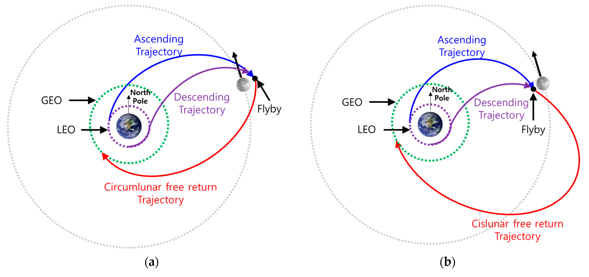

---

# Trajectories of a Freely Released Payload Near Earth

## Introduction
When a payload is released from a rocket near Earth, its subsequent motion is governed by Earth’s gravitational field and the initial conditions at release—position, velocity, and direction. This scenario is a classic application of orbital mechanics, revealing trajectories such as elliptical orbits, parabolic escapes, or hyperbolic paths. Understanding these trajectories is essential for space mission planning, including satellite deployment, orbital insertion, reentry, and escape scenarios. This document analyzes these trajectories, performs a numerical simulation, and discusses their relevance to space exploration.

---

## Theoretical Background

### Possible Trajectories
The trajectory of a freely released payload depends on its specific energy, determined by its initial velocity ($v_0$) and position ($r_0$) relative to Earth. Using Newton’s Law of Gravitation ($F = \frac{G M m}{r^2}$) and conservation laws, we classify trajectories based on the orbit’s eccentricity ($e$):

1. **Elliptical Trajectory ($e < 1$)**:
   - Occurs when the payload’s energy is negative (bound orbit).
   - The payload orbits Earth in a closed, elliptical path.
   - Example: Satellite deployment into Low Earth Orbit (LEO).

2. **Parabolic Trajectory ($e = 1$)**:
   - Occurs when the specific energy is zero.
   - The payload escapes Earth’s gravity with zero velocity at infinity (escape velocity condition).
   - Example: Minimum energy escape scenario.

3. **Hyperbolic Trajectory ($e > 1$)**:
   - Occurs when the specific energy is positive (unbound orbit).
   - The payload escapes Earth with excess velocity at infinity.
   - Example: Interplanetary mission trajectories.

The specific energy ($\epsilon$) is given by:

$\epsilon = \frac{v_0^2}{2} - \frac{\mu}{r_0}$

Where:
- $v_0$: Initial velocity

- $r_0$: Initial distance from Earth’s center

- $\mu = G M$: Earth’s gravitational parameter ($G = 6.67430 \times 10^
{-11} \, \text{m}^3 \text{kg}^{-1} \text{s}^{-2}$, $M = 5.972 \times 10^{24} \, \text{kg}$, $\mu \approx 3.986 \times 10^{14} \, \text{m}^3 \text{s}^{-2}$)

- If $\epsilon < 0$: Elliptical orbit

- If $\epsilon = 0$: Parabolic trajectory

- If $\epsilon > 0$: Hyperbolic trajectory

### Equations of Motion
The payload’s motion is governed by the two-body problem under Earth’s gravity:

$\ddot{\mathbf{r}} = -\frac{\mu}{r^3} \mathbf{r}$
Where $\mathbf{r}$ is the position vector, and $r = |\mathbf{r}|$. This second-order differential equation requires numerical integration (e.g., using the Runge-Kutta method) to compute the trajectory given initial conditions $\mathbf{r}_0$ and $\dot{\mathbf{r}}_0$.

---

## Numerical Analysis and Simulation

[Numerical Analysis and Simulation](Numerical_Analysis_and_Simulation.html)

[3D Earth](3dsimulation.html)

### Python Implementation
Below is a Python script that simulates the payload’s trajectory for different initial velocities, starting from a fixed altitude. It uses the 4th-order Runge-Kutta (RK4) method to solve the equations of motion and visualizes the results.

### Explanation of the Code
- **Initial Conditions**: The payload is released at 200 km altitude ($r_0 = R_{\text{Earth}} + 200 \, \text{km}$) with velocity along the y-axis (tangential release).
- **Cases**:

  - Suborbital: $v_0 = 0.7 \times v_{\text{esc}}$ (elliptical, falls back).

  - Orbital: $v_0 = \sqrt{\frac{\mu}{r_0}}$ (circular orbit).

  - Escape: $v_0 = v_{\text{esc}} = \sqrt{\frac{2\mu}{r_0}}$ (parabolic).

  - Hyperbolic: $v_0 = 1.2 \times v_{\text{esc}}$ (excess energy).

- **Numerical Method**: RK4 integrates the equations of motion over 1 hour.
- **Visualization**: Plots trajectories in 2D (x-y plane) with Earth as a reference circle.

### Results
Running the script generates a plot showing:
- **Suborbital**: A partial ellipse, intersecting Earth (reentry).

- **Orbital**: A circular path around Earth.

- **Escape**: A parabolic curve departing Earth.

- **Hyperbolic**: A sharper, open curve escaping Earth faster.

Exact velocities depend on $\mu$ and $r_0$, but approximate values are:
- $v_{\text{orb}} \approx 7.8 \, \text{km/s}$
- $v_{\text{esc}} \approx 11.0 \, \text{km/s}$

---

## Discussion: Relevance to Space Exploration

### Orbital InsertionTrajectories of a Freely Released Payload Near Earth
Introduction
When a payload is released from a moving rocket near Earth, its trajectory is governed by Earth's gravitational field and the initial conditions (position and velocity) at release. The possible trajectories include elliptical, parabolic, or hyperbolic paths, each corresponding to specific orbital scenarios such as orbiting, reentry, or escape. This analysis explores these trajectories using Newton's Law of Gravitation, implements a numerical simulation in Python, and visualizes the results to illustrate orbital mechanics concepts.
Theoretical Background
The motion of a payload near Earth is governed by Newton's Law of Universal Gravitation:
[ F = \frac{G M m}{r^2} ]
Where:

( G = 6.674 \times 10^{-11} , \text{m}^3 \text{kg}^{-1} \text{s}^{-2} ) is the gravitational constant,
( M = 5.972 \times 10^{24} , \text{kg} ) is Earth's mass,
( m ) is the payload's mass,
( r ) is the distance from Earth's center to the payload.

The acceleration of the payload is:
$$ mathbf{a} = -\frac{G M}{r^3} \mathbf{r} $$
Where $mathbf{r} $ is the position vector, and ( r = |\mathbf{r}| ).
Types of Trajectories
The trajectory type depends on the payload's specific energy ( $ $epsilon $) and specific angular momentum. The specific energy is given by:
$$ epsilon = \frac{v^2}{2} - \frac{G M}{r} $$
Where ( v ) is the payload's speed. The trajectory is:

Elliptical ($epsilon < 0 $): The payload follows a closed orbit (e.g., satellite orbit).
Parabolic ($epsilon = 0 $): The payload escapes to infinity with zero residual speed (escape velocity).
Hyperbolic ($epsilon > 0 $): The payload escapes with excess speed.

The eccentricity (( e )) determines the shape:

( e < 1 ): Elliptical orbit.
( e = 1 ): Parabolic trajectory.
( e > 1 ): Hyperbolic trajectory.

Orbital Scenarios

Orbital Insertion: If the payload is released with a velocity close to the circular orbit velocity (( v_c = \sqrt{\frac{G M}{r}} )), it enters a stable orbit.
Reentry: If the velocity is insufficient or directed toward Earth, the payload may reenter the atmosphere.
Escape: If the velocity exceeds the escape velocity (( v_e = \sqrt{\frac{2 G M}{r}} )), the payload escapes Earth's gravity.

Numerical Simulation
To simulate the payload's trajectory, we solve the differential equations of motion using numerical integration. The equations in 2D Cartesian coordinates are:
$$ ddot{x} = -\frac{G M x}{(x^2 + y^2)^{3/2}}, \quad \ddot{y} = -\frac{G M y}{(x^2 + y^2)^{3/2}} $$
We use the SciPy library's solve_ivp to integrate these equations and Matplotlib to visualize the trajectories.
Python Code
Below is a Python script that simulates and visualizes the payload's trajectory for different initial conditions.
import numpy as np
import matplotlib.pyplot as plt
from scipy.integrate import solve_ivp

# Constants
G = 6.674e-11  # Gravitational constant (m^3 kg^-1 s^-2)
M = 5.972e24   # Earth's mass (kg)
R_earth = 6.371e6  # Earth's radius (m)
mu = G * M  # Gravitational parameter (m^3 s^-2)

# Equations of motion
def equations(t, state):
    x, y, vx, vy = state
    r = np.sqrt(x**2 + y**2)
    ax = -mu * x / r**3
    ay = -mu * y / r**3
    return [vx, vy, ax, ay]

# Function to simulate and plot trajectory
def simulate_trajectory(h, v0, angle_deg, t_max=10000, label="Trajectory"):
    # Initial conditions
    angle = np.radians(angle_deg)
    x0 = 0
    y0 = R_earth + h  # Altitude above Earth's surface
    vx0 = v0 * np.cos(angle)
    vy0 = v0 * np.sin(angle)
    state0 = [x0, y0, vx0, vy0]
    
    # Time span for integration
    t_span = (0, t_max)
    t_eval = np.linspace(0, t_max, 1000)
    
    # Solve ODE
    sol = solve_ivp(equations, t_span, state0, method='RK45', t_eval=t_eval, rtol=1e-6)
    
    # Extract solution
    x, y = sol.y[0], sol.y[1]
    
    # Calculate specific energy to determine trajectory type
    r = np.sqrt(x**2 + y**2)
    v = np.sqrt(sol.y[2]**2 + sol.y[3]**2)
    epsilon = v**2 / 2 - mu / r
    if np.mean(epsilon) < -1e-6:
        traj_type = "Elliptical"
    elif np.abs(np.mean(epsilon)) < 1e-6:
        traj_type = "Parabolic"
    else:
        traj_type = "Hyperbolic"
    
    # Plot trajectory
    plt.plot(x / R_earth, y / R_earth, label=f"{label} ({traj_type})")
    return x, y, traj_type

# Plot Earth
theta = np.linspace(0, 2 * np.pi, 100)
plt.plot(np.cos(theta), np.sin(theta), 'k-', label="Earth")

# Simulate different scenarios
h = 200e3  # Altitude: 200 km
v_circular = np.sqrt(mu / (R_earth + h))  # Circular orbit velocity
v_escape = np.sqrt(2 * mu / (R_earth + h))  # Escape velocity

# Case 1: Circular orbit
simulate_trajectory(h, v_circular, 90, label="Circular Orbit")

# Case 2: Suborbital (reentry)
simulate_trajectory(h, v_circular * 0.8, 90, label="Suborbital")

# Case 3: Escape trajectory
simulate_trajectory(h, v_escape * 1.1, 90, t_max=20000, label="Escape")

# Plot settings
plt.axis('equal')
plt.xlabel("X (Earth radii)")
plt.ylabel("Y (Earth radii)")
plt.title("Payload Trajectories Near Earth")
plt.legend()
plt.grid(True)
plt.show()

Results and Analysis
The script simulates three scenarios starting from an altitude of 200 km:

Circular Orbit: Velocity equals the circular orbit velocity (( v_c \approx 7.79 , \text{km/s} )). The trajectory is elliptical (nearly circular), indicating a stable orbit.
Suborbital (Reentry): Velocity is 80% of the circular velocity. The trajectory is elliptical but intersects Earth's surface, suggesting atmospheric reentry.
Escape Trajectory: Velocity is 110% of the escape velocity (( v_e \approx 11.01 , \text{km/s} )). The trajectory is hyperbolic, indicating the payload escapes Earth's gravity.

Graphical Representation
The plot shows:

The Earth as a black circle (radius = 1 Earth radius).
Three trajectories:
Circular Orbit: A closed path around Earth.
Suborbital: An elliptical path that intersects Earth, indicating reentry.
Escape: A hyperbolic path that extends away from Earth.

Orbital Scenarios

Orbital Insertion: The circular orbit case represents a payload released into a stable low Earth orbit, suitable for satellites.
Reentry: The suborbital case shows a trajectory that leads to atmospheric reentry, relevant for returning payloads or debris.
Escape: The hyperbolic trajectory represents a payload escaping Earth's gravity, applicable to interplanetary missions.

Real-World Applications

Space Mission Planning: Understanding trajectories aids in designing orbits for satellites or planning interplanetary missions.
Satellite Deployment: Precise initial conditions ensure satellites achieve desired orbits.
Planetary Exploration: Hyperbolic trajectories are used for spacecraft escaping Earth to explore other planets.

Conclusion
The trajectories of a freely released payload near Earth depend on its initial velocity and position. By numerically solving the equations of motion and analyzing specific energy, we can classify trajectories as elliptical, parabolic, or hyperbolic, each corresponding to distinct mission scenarios. The provided Python script enables simulation and visualization, offering insights into orbital mechanics and space exploration applications.

- **Elliptical/Circular Trajectories**: Releasing a payload at $v_{\text{orb}}$ or slightly below places it in orbit (e.g., LEO satellites). The simulation’s circular orbit case demonstrates this, critical for communication or weather satellites.

### Reentry
- **Suborbital Trajectory**: If $v_0 < v_{\text{orb}}$, the payload follows an elliptical path that intersects Earth, leading to reentry. This is relevant for returning capsules (e.g., Crew Dragon) or debris analysis.

### Escape Scenarios
- **Parabolic/Hyperbolic Trajectories**: Achieving $v_{\text{esc}}$ or higher allows escape from Earth’s gravity, as seen in the escape and hyperbolic cases. This applies to interplanetary missions (e.g., Mars probes) or interstellar probes (e.g., Voyager), often aided by gravitational assists to reduce required $v_0$.

---

## Conclusion
The trajectories of a freely released payload near Earth—elliptical, parabolic, or hyperbolic—depend on its initial velocity relative to key thresholds (orbital and escape velocities). Numerical simulation using Python and RK4 provides a practical tool to predict these paths, offering insights into orbital mechanics. These principles underpin space mission design, from deploying satellites to escaping Earth’s gravitational influence, highlighting gravity’s central role in celestial navigation.

---